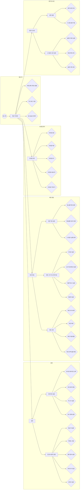

```mermaid
flowchart LR

  subgraph s1 ["메인 덱"]
    n1(("앱 시작"))
    n2["메인 덱 화면"]
    n3{"버튼 클릭 (액션 실행)"}
    n4{"덱 드래그 이동"}
    n5{"표시/숨김 단축키"}
  end

  subgraph s2 ["설정"]
    n6["설정"]
    n7["레이아웃 설정"]
    n8{"프리셋 레이아웃 선택"}
    n9{"자유 배치 편집"}
    n10{"덱 크기 설정"}
    n11{"표시 형태 설정"}
    n12["앱 표시/동작 설정"]
    n13{"항상 위 설정"}
    n14{"투명도 조절"}
    n15{"클릭 통과 설정"}
    n16{"위치/크기 잠금"}
    n17{"단축키 설정"}
  end

  subgraph s3 ["버튼 편집"]
    n18["버튼 편집"]
    n19["버튼 액션 설정"]
    n20{"앱 실행 액션 등록"}
    n21{"파일/폴더 열기 등록"}
    n22{"스크립트 실행 등록"}
    n23["버튼 시각 커스터마이징"]
    n24{"아이콘 설정"}
    n25{"GIF 애니메이션 설정"}
    n26{"라벨 텍스트 설정"}
    n27{"배경색 설정"}
    n28["버튼 관리"]
    n29{"버튼 추가/삭제"}
    n30{"버튼 복제"}
    n31{"버튼 이동/정렬"}
    n32{"다중 선택 일괄 편집"}
  end

  subgraph s4 ["프로필 관리"]
    n33["프로필 관리"]
    n34{"프로필 생성"}
    n35{"프로필 저장"}
    n36{"프로필 로드"}
    n37{"프로필 내보내기"}
    n38{"프로필 가져오기"}
  end

  subgraph s5 ["권한 및 보안"]
    n39["권한 및 보안"]
    n40["권한 설정"]
    n41{"권한 요청 안내"}
    n42{"시스템 설정 이동"}
    n43["스크립트 보안 설정"]
    n44{"실행 전 확인 설정"}
    n45{"허용 목록 관리"}
    n46{"실행 기록 조회"}
  end

  n1 --> n2
  n2 --> n3
  n2 --> n4
  n2 --> n5
  n2 --> n6
  n2 --> n18
  n2 --> n33
  n2 --> n39
  n6 --> n7
  n6 --> n12
  n7 --> n8
  n7 --> n9
  n7 --> n10
  n7 --> n11
  n12 --> n13
  n12 --> n14
  n12 --> n15
  n12 --> n16
  n12 --> n17
  n18 --> n19
  n18 --> n23
  n18 --> n28
  n19 --> n20
  n19 --> n21
  n19 --> n22
  n23 --> n24
  n23 --> n25
  n23 --> n26
  n23 --> n27
  n28 --> n29
  n28 --> n30
  n28 --> n31
  n28 --> n32
  n33 --> n34
  n33 --> n35
  n33 --> n36
  n33 --> n37
  n33 --> n38
  n39 --> n40
  n39 --> n43
  n40 --> n41
  n40 --> n42
  n43 --> n44
  n43 --> n45
  n43 --> n46
```
